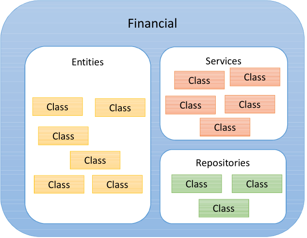
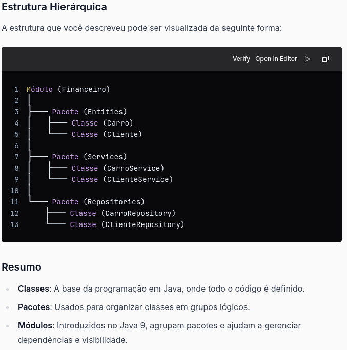
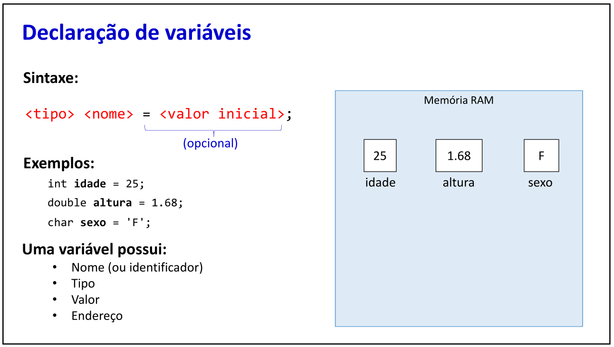
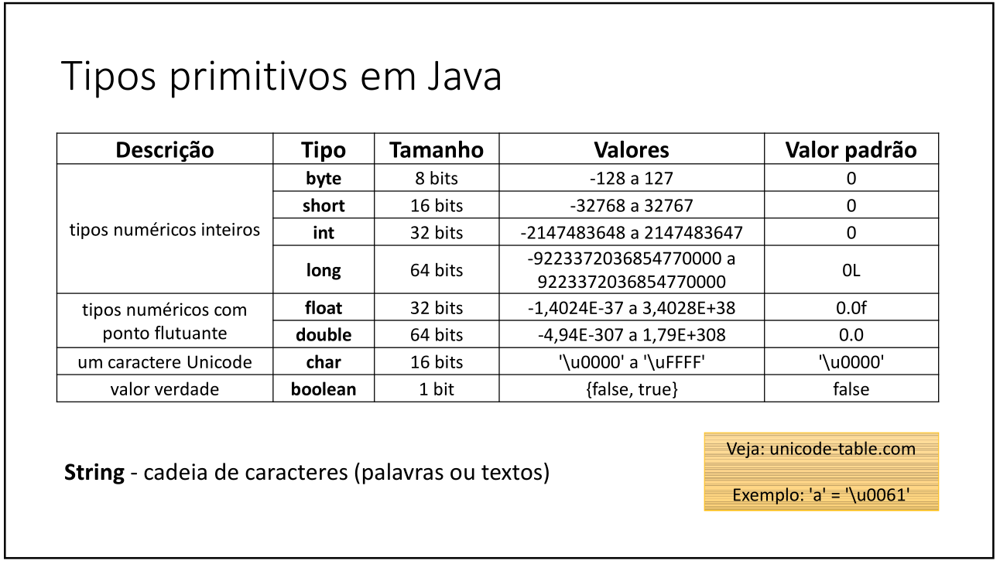

# RESUMO DO ESTUDO DA LINGUAGEM JAVA

## Introdução
Esse material será composto de uma maneira que faça sentido para mim, quando eu rever saber do que se trata.

O conteúdo deste projeto foi retirado do curso `Java COMPLETO Programação Orientada a Objetos + Projetos`
do _Nélio Alves_ na [Udemy](https://www.udemy.com/course/java-curso-completo/).
 
Esse resumo esta sendo feito por mim [Kaio Campos](https://github.com/kaiokampos) para futuras consultas, e esse projeto está de acordo com o material disponibilizado pelo professor.

## Estrutura de uma aplicação Java

Java é uma linguagem orientada a objetos, e a base de um objeto é uma classe, todo o código java tem que está dentro de classes.
Depois da classe tem o conceito de package(pacotes), onde separamos as classes nos seus pacotes (`Entities`, `Services`, `Repositories`).
Depois do package temos o Módulo, onde agrupamos os pacotes. MÓDULO(Financeiro) > PACKAGES(Entities, Services) > CLASSES.




## Expressões aritméticas

Basicamente as mesmas operações aritméticas visto na matemática básica, com a mesma ordem de precedência.

Ordem de Precedência dos Operadores Aritméticos em Java.

Parênteses (): Operações dentro de parênteses são realizadas primeiro.

Exemplo: (a + b) * c

Exponenciação: Java não possui um operador de exponenciação nativo, mas você pode usar Math.pow(base, expoente) para calcular potências.
Multiplicação *, Divisão /, e Módulo %: Esses operadores têm a mesma precedência e são avaliados da esquerda para a direita.

Exemplo: a * b / c % d

Adição + e Subtração -: Esses operadores também têm a mesma precedência e são avaliados da esquerda para a direita.

Exemplo: a + b - c

## Variáveis e tipos primitivos em Java

Definição informal:
Em programação, uma variável é uma porção de memória (RAM) utilizada para armazenar
dados durante a execução dos programas.




## Casting em Java
Optei por adicionar esse resumo logo abaixo das imagens, pois fica bem mais visual e fácil de entender.

1. Casting Implícito (Widening Casting)
   O casting implícito ocorre quando você converte um tipo de dado menor para um tipo de dado maior. Isso é feito automaticamente pelo compilador, pois não há perda de dados. Por exemplo, você pode converter um int para um long, float ou double.


```java
public class CastingExemplo {
    public static void main(String[] args) {
        int numeroInt = 100;
        long numeroLong = numeroInt; // Casting implícito de int para long
        float numeroFloat = numeroInt; // Casting implícito de int para float
        double numeroDouble = numeroInt; // Casting implícito de int para double

        System.out.println("Número Int: " + numeroInt);
        System.out.println("Número Long: " + numeroLong);
        System.out.println("Número Float: " + numeroFloat);
        System.out.println("Número Double: " + numeroDouble);
    }
}
Saída:
Número Int: 100
Número Long: 100
Número Float: 100.0
Número Double: 100.0
```
2. Casting Explícito (Narrowing Casting)
   O casting explícito é necessário quando você converte um tipo de dado maior para um tipo de dado menor. Isso deve ser feito manualmente, pois pode haver perda de dados. Por exemplo, você pode converter um double para um int.

```java
public class CastingExemplo {
    public static void main(String[] args) {
        double numeroDouble = 9.78;
        int numeroInt = (int) numeroDouble; // Casting explícito de double para int

        System.out.println("Número Double: " + numeroDouble);
        System.out.println("Número Int: " + numeroInt); // A parte decimal é perdida
    }
}
Saída:
Número Double: 9.78
Número Int: 9
```
## Entrada de dados via console
Scanner
Para fazer entrada de dados, nós vamos criar um objeto do tipo "Scanner" da seguinte forma:

Scanner sc = new Scanner(System.in);

import java.util.Scanner;

faça sc.close() quando não precisar mais do objeto sc
```java
import java.util.Locale;
import java.util.Scanner;

public class Main {
   public static void main(String[] args) {
      Locale.setDefault(Locale.US);
      Scanner sc = new Scanner(System.in);

      sc.close();
   }
}
```
Scanner

• next() -> lê uma palavra

• nextInt() -> lê um inteiro

• nextDouble() -> lê um double

• next().charAt(0) -> lê um charactere

• Locale -> para definir o PONTO OU A VIRGULA

• Como ler até a quebra de linha:

    usando nextLine()
    como limpar o buffer de leitura -> Solução:
       Faça um nextLine() extra antes de
       fazer o nextLine() de seu interesse.


## Resumo: Estrutura Condicional em Java

## **1. Expressões Comparativas**
### **Definição**
Comparações entre valores utilizando operadores:
- `>`: maior
- `<`: menor
- `>=`: maior ou igual
- `<=`: menor ou igual
- `==`: igual
- `!=`: diferente

### **Exemplo**
```java
int x = 5;
System.out.println(x > 3);  // true
System.out.println(x == 10);  // false
```
## **2. Expressões Lógicas**
### **Definição**
Combinações lógicas de condições utilizando operadores:
- `&&` (E): todas as condições devem ser verdadeiras.
- `||` (OU): pelo menos uma condição deve ser verdadeira.
- `!` (NÃO): inverte o valor lógico.


### **Exemplo**
```java
int x = 5;
System.out.println(x > 0 && x < 10);  // true
System.out.println(x < 0 || x == 5);  // true
System.out.println(!(x > 10));  // true
```

## **3. Estrutura Condicional (if-else)**
### **Definição**
Permite executar blocos de código baseados em condições.

### **Exemplo**
```java
Sintaxe
if (condição) {
        // código se verdadeiro
        } else {
        // código se falso
        }
}

Exemplo:
int horas = 15;
if (horas < 12) {
        System.out.println("Bom dia!");
} else if (horas < 18) {
        System.out.println("Boa tarde!");
} else {
        System.out.println("Boa noite!");
}
```
## **4. Estrutura switch-case**
### **Definição**
Alternativa ao if-else para múltiplas condições baseadas em um único valor.

### **Exemplo**
```java
int dia = 3;
switch (dia) {
        case 1: 
            System.out.println("Domingo"); 
            break;
        case 2: 
            System.out.println("Segunda"); 
            break;
        case 3: 
            System.out.println("Terça"); 
            break;
        default: 
            System.out.println("Valor inválido"); 
            break;
        }
```

## **5. Operadores de Atribuição Cumulativa**
### **Definição**
Reduzem a necessidade de escrever expressões completas:
- `a += b;` é equivalente a `a = a + b;` 
- `a *= b;` é equivalente a `a = a * b;`

### **Exemplo**
```java
iint a = 10;
a += 5;  // a = 15
a *= 2;  // a = 30
System.out.println(a);
```
## **6. Expressão Condicional Ternária**
### **Definição**
Alternativa simplificada ao if-else para atribuição de valores.

Sintaxe: `(condição) ? valor_se_verdadeiro : valor_se_falso.`

### **Exemplo**
```java
int preco = 50;
String desconto = (preco > 100) ? "10%" : "5%";
System.out.println(desconto);
```
## **7. Escopo e Inicialização de Variáveis**
### **Definição**
Escopo: a região do programa onde a variável é válida. Se ela for declarada dentro do escopo da funão só será válida dentro da função.
Inicialização: uma variável deve ser inicializada antes de ser usada.

### **Exemplo**
```java
int x;
if (true) {
x = 10;  // Inicialização dentro do escopo
        }
        System.out.println(x);  // OK
```
# Estruturas Repetitivas em Java

Este resumo aborda os principais conceitos e exemplos de estruturas repetitivas em Java. Estas estruturas são usadas para executar blocos de código várias vezes, dependendo de condições específicas.

---

## **1. Estrutura Repetitiva `while`**
### **Definição**
- Repete um bloco de comandos enquanto a condição for verdadeira.
- Usada quando **não se sabe previamente a quantidade de repetições**.

### **Sintaxe**
```java
while (condição) {
    // comandos
}
```
Exemplo
Problema: Somar números inteiros até que seja digitado 0.
```java
import java.util.Scanner;

Scanner sc = new Scanner(System.in);
int soma = 0;
int num = sc.nextInt();

while (num != 0) {
    soma += num;
    num = sc.nextInt();
}
System.out.println("Soma: " + soma);
sc.close();
```


