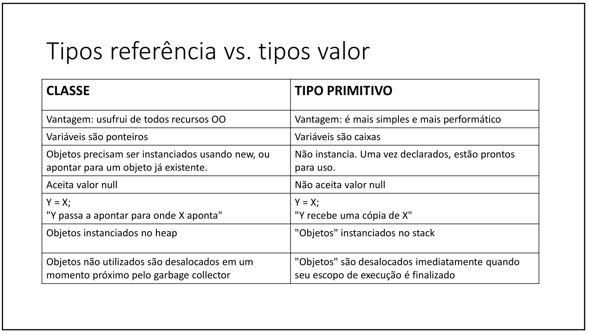
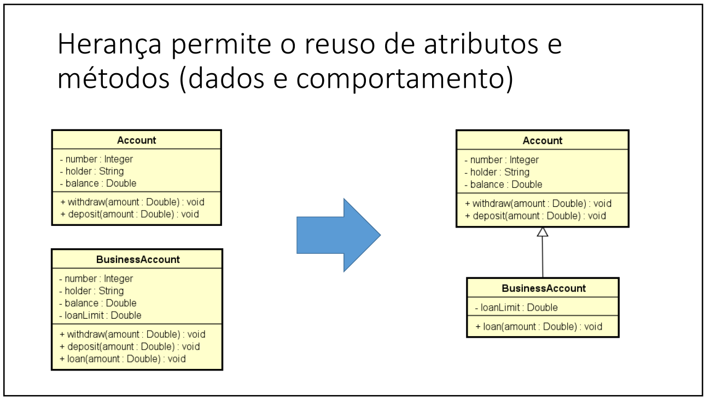

# RESUMO DO ESTUDO DA LINGUAGEM JAVA
 TESTE DE GIT NO NOTE
## Introdução
Esse material será composto de uma maneira que faça sentido para mim, quando eu rever saber do que se trata.

O conteúdo deste projeto foi retirado do curso `Java COMPLETO Programação Orientada a Objetos + Projetos`
do _Nélio Alves_ na [Udemy](https://www.udemy.com/course/java-curso-completo/).
 
Esse resumo esta sendo feito por mim [Kaio Campos](https://github.com/kaiokampos) para futuras consultas, e esse projeto está de acordo com o material disponibilizado pelo professor.

## Estrutura de uma aplicação Java

Java é uma linguagem orientada a objetos, e a base de um objeto é uma classe, todo o código java tem que está dentro de classes.
Depois da classe tem o conceito de package(pacotes), onde separamos as classes nos seus pacotes (`Entities`, `Services`, `Repositories`).
Depois do package temos o Módulo, onde agrupamos os pacotes. MÓDULO(Financeiro) > PACKAGES(Entities, Services) > CLASSES.


## Expressões aritméticas

Basicamente as mesmas operações aritméticas visto na matemática básica, com a mesma ordem de precedência.

Ordem de Precedência dos Operadores Aritméticos em Java.

Parênteses (): Operações dentro de parênteses são realizadas primeiro.

Exemplo: (a + b) * c

Exponenciação: Java não possui um operador de exponenciação nativo, mas você pode usar Math.pow(base, expoente) para calcular potências.
Multiplicação *, Divisão /, e Módulo %: Esses operadores têm a mesma precedência e são avaliados da esquerda para a direita.

Exemplo: a * b / c % d

Adição + e Subtração -: Esses operadores também têm a mesma precedência e são avaliados da esquerda para a direita.

Exemplo: a + b - c

## Variáveis e tipos primitivos em Java

Definição informal:
Em programação, uma variável é uma porção de memória (RAM) utilizada para armazenar
dados durante a execução dos programas.


## Casting em Java
Optei por adicionar esse resumo logo abaixo das imagens, pois fica bem mais visual e fácil de entender.

1. Casting Implícito (Widening Casting)
   O casting implícito ocorre quando você converte um tipo de dado menor para um tipo de dado maior. Isso é feito automaticamente pelo compilador, pois não há perda de dados. Por exemplo, você pode converter um int para um long, float ou double.


```java
public class CastingExemplo {
    public static void main(String[] args) {
        int numeroInt = 100;
        long numeroLong = numeroInt; // Casting implícito de int para long
        float numeroFloat = numeroInt; // Casting implícito de int para float
        double numeroDouble = numeroInt; // Casting implícito de int para double

        System.out.println("Número Int: " + numeroInt);
        System.out.println("Número Long: " + numeroLong);
        System.out.println("Número Float: " + numeroFloat);
        System.out.println("Número Double: " + numeroDouble);
    }
}
Saída:
Número Int: 100
Número Long: 100
Número Float: 100.0
Número Double: 100.0
```
2. Casting Explícito (Narrowing Casting)
   O casting explícito é necessário quando você converte um tipo de dado maior para um tipo de dado menor. Isso deve ser feito manualmente, pois pode haver perda de dados. Por exemplo, você pode converter um double para um int.

```java
public class CastingExemplo {
    public static void main(String[] args) {
        double numeroDouble = 9.78;
        int numeroInt = (int) numeroDouble; // Casting explícito de double para int

        System.out.println("Número Double: " + numeroDouble);
        System.out.println("Número Int: " + numeroInt); // A parte decimal é perdida
    }
}
Saída:
Número Double: 9.78
Número Int: 9
```
## Entrada de dados via console
Scanner
Para fazer entrada de dados, nós vamos criar um objeto do tipo "Scanner" da seguinte forma:

Scanner sc = new Scanner(System.in);

import java.util.Scanner;

faça sc.close() quando não precisar mais do objeto sc
```java
import java.util.Locale;
import java.util.Scanner;

public class Main {
   public static void main(String[] args) {
      Locale.setDefault(Locale.US);
      Scanner sc = new Scanner(System.in);

      sc.close();
   }
}
```
Scanner

• next() -> lê uma palavra

• nextInt() -> lê um inteiro

• nextDouble() -> lê um double

• next().charAt(0) -> lê um charactere

• Locale -> para definir o PONTO OU A VIRGULA

• Como ler até a quebra de linha:

    usando nextLine()
    como limpar o buffer de leitura -> Solução:
       Faça um nextLine() extra antes de
       fazer o nextLine() de seu interesse.


## Resumo: Estrutura Condicional em Java

## **1. Expressões Comparativas**
### **Definição**
Comparações entre valores utilizando operadores:
- `>`: maior
- `<`: menor
- `>=`: maior ou igual
- `<=`: menor ou igual
- `==`: igual
- `!=`: diferente

### **Exemplo**
```java
int x = 5;
System.out.println(x > 3);  // true
System.out.println(x == 10);  // false
```
## **2. Expressões Lógicas**
### **Definição**
Combinações lógicas de condições utilizando operadores:
- `&&` (E): todas as condições devem ser verdadeiras.
- `||` (OU): pelo menos uma condição deve ser verdadeira.
- `!` (NÃO): inverte o valor lógico.


### **Exemplo**
```java
int x = 5;
System.out.println(x > 0 && x < 10);  // true
System.out.println(x < 0 || x == 5);  // true
System.out.println(!(x > 10));  // true
```

## **3. Estrutura Condicional (if-else)**
### **Definição**
Permite executar blocos de código baseados em condições.

### **Exemplo**
```java
Sintaxe
if (condição) {
        // código se verdadeiro
        } else {
        // código se falso
        }
}

Exemplo:
int horas = 15;
if (horas < 12) {
        System.out.println("Bom dia!");
} else if (horas < 18) {
        System.out.println("Boa tarde!");
} else {
        System.out.println("Boa noite!");
}
```
## **4. Estrutura switch-case**
### **Definição**
Alternativa ao if-else para múltiplas condições baseadas em um único valor.

### **Exemplo**
```java
int dia = 3;
switch (dia) {
        case 1: 
            System.out.println("Domingo"); 
            break;
        case 2: 
            System.out.println("Segunda"); 
            break;
        case 3: 
            System.out.println("Terça"); 
            break;
        default: 
            System.out.println("Valor inválido"); 
            break;
        }
```

## **5. Operadores de Atribuição Cumulativa**
### **Definição**
Reduzem a necessidade de escrever expressões completas:
- `a += b;` é equivalente a `a = a + b;` 
- `a *= b;` é equivalente a `a = a * b;`

### **Exemplo**
```java
iint a = 10;
a += 5;  // a = 15
a *= 2;  // a = 30
System.out.println(a);
```
## **6. Expressão Condicional Ternária**
### **Definição**
Alternativa simplificada ao if-else para atribuição de valores.

Sintaxe: `(condição) ? valor_se_verdadeiro : valor_se_falso.`

### **Exemplo**
```java
int preco = 50;
String desconto = (preco > 100) ? "10%" : "5%";
System.out.println(desconto);
```
## **7. Escopo e Inicialização de Variáveis**
### **Definição**
Escopo: a região do programa onde a variável é válida. Se ela for declarada dentro do escopo da funão só será válida dentro da função.
Inicialização: uma variável deve ser inicializada antes de ser usada.

### **Exemplo**
```java
int x;
if (true) {
x = 10;  // Inicialização dentro do escopo
        }
        System.out.println(x);  // OK
```
# Estruturas Repetitivas em Java

Este resumo aborda os principais conceitos e exemplos de estruturas repetitivas em Java. Estas estruturas são usadas para executar blocos de código várias vezes, dependendo de condições específicas.

---

## **1. Estrutura Repetitiva `while`**
### **Definição**
- Repete um bloco de comandos enquanto a condição for verdadeira.
- Usada quando **não se sabe previamente a quantidade de repetições**.

### **Sintaxe**
```java
while (condição) {
    // comandos
}
```
Exemplo
Problema: Somar números inteiros até que seja digitado 0.
```java
import java.util.Scanner;

Scanner sc = new Scanner(System.in);
int soma = 0;
int num = sc.nextInt();

while (num != 0) {
    soma += num;
    num = sc.nextInt();
}
System.out.println("Soma: " + soma);
sc.close();
```

## **2. Estrutura Repetitiva `for`**
### **Definição**
   Executa um bloco de comandos para um intervalo de valores.
   Usada quando se sabe previamente a quantidade de repetições.
### **Sintaxe**
```java
for (início; condição; incremento) {
    // comandos
}
```
Exemplo
Problema: Ler N números inteiros e calcular a soma.
```java
import java.util.Scanner;

Scanner sc = new Scanner(System.in);
int N = sc.nextInt();
int soma = 0;

for (int i = 0; i < N; i++) {
    int num = sc.nextInt();
    soma += num;
}
System.out.println("Soma: " + soma);
sc.close();
```


## **3. Estrutura Repetitiva `do-while`**
### **Definição**
Executa o bloco de comandos pelo menos uma vez, pois a condição é verificada no final.
```java
do {
        // comandos
        } while (condição);

```
Exemplo
Problema: Converter temperaturas de Celsius para Fahrenheit até o usuário decidir parar.
```java
import java.util.Scanner;

Scanner sc = new Scanner(System.in);
char resposta;

do {
        System.out.print("Digite a temperatura em Celsius: ");
double C = sc.nextDouble();
double F = 9.0 * C / 5.0 + 32.0;
    System.out.printf("Equivalente em Fahrenheit: %.1f%n", F);

    System.out.print("Deseja repetir (s/n)? ");
    resposta = sc.next().charAt(0);
} while (resposta != 'n');

        sc.close();
```

# Programação Orientada a Objetos com Java
Primeiramente precisamos ve um código ou problema sem orientação a objetos, para podermos entender a solução com orientação a objetos

Problema: Fazer um programa para ler as medidas dos lados de dois triângulos X e Y (suponha medidas
válidas). Em seguida, mostrar o valor das áreas dos dois triângulos e dizer qual dos dois triângulos
possui a maior área.
A fórmula para calcular a área de um triângulo a partir das medidas de seus lados a, b e c é a
seguinte (fórmula de Heron):

```java
import java.util.Locale;
import java.util.Scanner;

public class Program {
       public static void main(String[] args) {

          Locale.setDefault(Locale.US);
          Scanner sc = new Scanner(System.in);
          double xA, xB, xC, yA, yB, yC;
          
          System.out.println("Enter the measures of triangle X: ");
          xA = sc.nextDouble();
          xB = sc.nextDouble();
          xC = sc.nextDouble();
          
          System.out.println("Enter the measures of triangle Y: ");
          yA = sc.nextDouble();
          yB = sc.nextDouble();
          yC = sc.nextDouble();
          
          double p = (xA + xB + xC) / 2.0;
          double areaX = Math.sqrt(p * (p - xA) * (p - xB) * (p - xC));
          
          p = (yA + yB + yC) / 2.0;
          double areaY = Math.sqrt(p * (p - yA) * (p - yB) * (p - yC));
          
          System.out.printf("Triangle X area: %.4f%n", areaX);
          System.out.printf("Triangle Y area: %.4f%n", areaY);
          
          if (areaX > areaY) {
              System.out.println("Larger area: X");
          } else {
              System.out.println("Larger area: Y");
          }
          
          sc.close();
   }
}
```
Como podemos observar e pontuar no código acima, para representar o triângulo tivemos que usar 3 variáveis diferentes para 
cada lado do triângulo, vou pontuar alguns "defeitos", uso de memória, legibilidade, desempenho...

## Vou apresentar uns conceitos sobre Orientação a Objetos
A programação orientada a objetos (POO) é um paradigma que organiza o código em torno de objetos, que representam entidades do mundo real. Para entender isso em detalhes, precisamos explorar os conceitos de classes, objetos e atributos.
### **Classes, Objetos, Atributos**

### 1. Classes:

#### **Definição**

- Uma classe é um modelo ou molde que define os atributos (características) e métodos (comportamentos) de um objeto.

- Pensa-se nela como uma "receita" ou "plano" para criar objetos.
```java
Estrutura de uma Classe em Java
        
public class Produto {
    // Atributos da classe
    String nome;
    double preco;
    int quantidade;

    // Método da classe
    public double calcularValorTotal() {
        return preco * quantidade;
    }
}

```
#### Componentes de uma Classe
1. Nome: A identidade da classe (Produto, por exemplo).
2. Atributos: Variáveis que armazenam as informações do objeto (classe).
3. Métodos: Funções que definem os comportamentos da classe (objeto).
4. Construtores: Método especial usado para inicializar objetos.

### 2. Objetos:
#### **Definição**

- Um objeto é uma instância de uma classe.
- Cada objeto criado a partir de uma classe pode ter seus próprios valores para os atributos definidos pela classe

```java
Criação de um Objeto
        
public class TestaProduto {
    public static void main(String[] args) {
        // Criando um objeto da classe Produto
        Produto p1 = new Produto();
        
        // Atribuindo valores aos atributos do objeto
        p1.nome = "Notebook";
        p1.preco = 3500.00;
        p1.quantidade = 5;

        // Chamando um método do objeto
        System.out.println("Valor total: " + p1.calcularValorTotal());
    }
}

```

#### Características dos Objetos
- Estado: Determinado pelos valores de seus atributos.
  - Exemplo: nome = "Notebook", preco = 3500.00, quantidade = 5.
- Comportamento: Definido pelos métodos que podem ser chamados no objeto.
  - Exemplo: p1.calcularValorTotal() retorna o valor total no estoque.
- Identidade: Cada objeto tem uma identidade única, mesmo que os valores dos atributos sejam iguais a outro objeto.

### 2. Atributos:
#### **Definição**
- Os atributos são as variáveis que armazenam os dados ou propriedades de um objeto.
- Eles definem o estado de um objeto.

#### **Tipos de Atributos**
1. Atributos de instância: Cada objeto tem sua própria cópia desses atributos.
   - Exemplo: Cada `Produto` pode ter valores diferentes para `nome`, `preco` e `quantidade`.
2. Atributos estáticos: Pertencem à classe e não a objetos individuais.

Exemplo
```java
public static double taxaDesconto;
```
### Modificadores de Acesso ###
`public`: Atributo acessível de qualquer lugar.

`private`: Atributo acessível apenas dentro da própria classe (boa prática).


# **Resumo: Relação Entre Classe, Objeto e Atributos**

| **Termo**  | **Descrição**                                   | **Exemplo**                 |
|------------|--------------------------------------------------|-----------------------------|
| **Classe** | Modelo para criar objetos                        | `Produto`                   |
| **Objeto** | Instância de uma classe                          | `Produto p1 = new Produto();` |
| **Atributo** | Característica que define o estado do objeto  | `nome`, `preco`, `quantidade` |

## **Exemplo Prático**

### **Classe Produto**
```java
public class Produto {
    // Atributos da classe
    private String nome;
    private double preco;
    private int quantidade;

    // Construtor para inicializar os atributos
    public Produto(String nome, double preco, int quantidade) {
        this.nome = nome;
        this.preco = preco;
        this.quantidade = quantidade;
    }

    // Métodos para acessar os atributos (Getters)
    public String getNome() {
        return nome;
    }

    public double getPreco() {
        return preco;
    }

    public int getQuantidade() {
        return quantidade;
    }

    // Método para calcular valor total no estoque
    public double calcularValorTotal() {
        return preco * quantidade;
    }
}
```
Criação de um Objeto

```java
public class TestaProduto {
    public static void main(String[] args) {
        // Criando um objeto da classe Produto
        Produto p1 = new Produto("Notebook", 3500.00, 5);

        // Exibindo informações sobre o produto
        System.out.println("Nome: " + p1.getNome());
        System.out.println("Preço: " + p1.getPreco());
        System.out.println("Quantidade: " + p1.getQuantidade());
        System.out.println("Valor Total: " + p1.calcularValorTotal());
    }
}
```

## Resumo: Construtores, Palavra `this`, Sobrecarga e Encapsulamento

### 1. **Construtores**
- Executam durante a instanciação do objeto.
- Usos principais:
    - Iniciar valores dos atributos.
    - Exigir que o objeto receba dados ao ser criado.
- Se um construtor personalizado não for especificado, a classe fornece um construtor padrão:
  ```java
  Product p = new Product();
  ```
- Possibilidade de sobrecarga de construtores (vários construtores com diferentes listas de parâmetros):
  ```java
  public Product(String name, double price) {
      this.name = name;
      this.price = price;
  }
  ```

### 2. **Palavra `this`**
- Referência ao próprio objeto.
- Usos comuns:
    - Diferenciar atributos de variáveis locais.
    - Passar o objeto atual como argumento para métodos.

Exemplo para diferenciar atributos locais:
```java
public Product(String name, double price) {
    this.name = name;
    this.price = price;
}
```

### 3. **Sobrecarga**
- Permite que uma classe tenha métodos ou construtores com o mesmo nome, mas diferentes listas de parâmetros.

Exemplo:
```java
public Product(String name, double price) { ... }
public Product(String name) { ... }
```

### 4. **Encapsulamento**
- Oculta os detalhes de implementação de uma classe, expondo apenas operações seguras.

#### Princípios:
- Manter o estado dos objetos consistente.
- Proteger atributos com modificadores de acesso (`private`, `public`, etc.).
- Utilizar **getters** e **setters** para acessar atributos privados:

Exemplo:
```java
private String name;
private double price;

public String getName() {
    return name;
}

public void setName(String name) {
    this.name = name;
}
```

### 5. **Modificadores de Acesso**
- `private`: acesso apenas dentro da classe.
- `protected`: acesso no mesmo pacote e em subclasses.
- `(default)`: acesso no mesmo pacote.
- `public`: acesso em qualquer classe.

### Exercício Prático
**Sistema bancário:**
- Cadastro de conta bancária com opção de valor inicial.
- Operações: Depósito, Saque (com taxa).
- Controle de saldo usando princípios de encapsulamento e sobrecarga de construtores.

**Exemplo:**
```text
Enter account number: 8532
Enter account holder: Alex Green
Is there an initial deposit (y/n)? y
Enter initial deposit value: 500.00

Account data:
Account 8532, Holder: Alex Green, Balance: $ 500.00

Enter a deposit value: 200.00
Updated account data:
Account 8532, Holder: Alex Green, Balance: $ 700.00

Enter a withdraw value: 300.00
Updated account data:
Account 8532, Holder: Alex Green, Balance: $ 395.00
```

## Resumo: Memória, Arrays e Listas em Java

### **1. Tipos de Dados em Java**
- **Tipos Referência**: Variáveis que armazenam endereços para objetos na memória.
- **Tipos Valor (Primitivos)**: Variáveis que armazenam diretamente os dados.



### **2. Gestão de Memória**
- **Garbage Collector**: Automatiza a liberação de memória desalocando objetos que não têm mais referências.
- **Escopo Local**: Variáveis locais são desalocadas assim que seu escopo termina.

### **3. Arrays - (Vetores)**
- Em programação, "vetor" é o nome dado a arranjos unidimensionais.
- Estruturas homogêneas e ordenadas que armazenam elementos do mesmo tipo.
- **Propriedades:**
    - **Tamanho fixo**: definido na criação.
    - **Acesso imediato**: elementos acessíveis por índices.
     - Alocada de uma vez só, em um bloco contíguo de memória
- **Vantagens:**
   - Acesso imediato aos elementos pela sua posição
- **Desvantagens:**
    - Tamanho fixo
    - Dificuldade para se realizar inserções e deleções.
- **Exemplos:**
    - Armazenar alturas de pessoas e calcular a média.
    - Armazenar dados de produtos e calcular o preço médio.

### **4. Listas**

Lista é uma estrutura de dados:
- Homogênea (dados do mesmo tipo)
- Ordenada (elementos acessados por meio de posições)
- Inicia vazia, e seus elementos são alocados sob demanda
- Cada elemento ocupa um "nó" (ou nodo) da lista
- Tipo (interface): List
- **Implementações Comuns:** `ArrayList`, `LinkedList`.

- **Vantagens:**
  - Tamanho variável
  - Facilidade para se realizar inserções e deleções

- **Desvantagens:**
  - Acesso sequencial aos elementos*

- **Operações:**
    - Adicionar, remover, acessar elementos.
    - Filtrar e buscar com expressões lambda.
 

- **Demo:**
- Tamanho da lista: `size()`
- Obter o elemento de uma posição: `get(position)`
- Inserir elemento na lista: `add(obj)`, `add(int, obj)`
- Remover elementos da lista: `remove(obj)`, `remove(int)`, `removeIf(Predicate)`
- Encontrar posição de elemento: `indexOf(obj)`, `lastIndexOf(obj)`
- Filtrar lista com base em predicado:
  - List<Integer> result = `list.stream().filter(x -> x > 4).collect(Collectors.toList());`
- Encontrar primeira ocorrência com base em predicado:
  - Integer result = `list.stream().filter(x -> x > 4).findFirst().orElse(null);`
```java
List<String> list = new ArrayList<>();
list.add("Maria");
list.add("Alex");
list.add("Bob");
list.add("Anna");
list.add(2, "Marco");
System.out.println(list.size());
for (String x : list) {
System.out.println(x);
}
System.out.println("---------------------");
list.removeIf(x -> x.charAt(0) == 'M');
for (String x : list) {
System.out.println(x);
}
System.out.println("---------------------");
System.out.println("Index of Bob: " + list.indexOf("Bob"));
System.out.println("Index of Marco: " + list.indexOf("Marco"));
System.out.println("---------------------");
List<String> result = list.stream().filter(x -> x.charAt(0) == 'A').collect(Collectors.toList());
for (String x : result) {
System.out.println(x);
}
System.out.println("---------------------");
String name = list.stream().filter(x -> x.charAt(0) == 'J').findFirst().orElse(null);
System.out.println(name);
}
```
### **5. Matrizes**
- Estruturas bidimensionais (vetor de vetores).
- **Vantagens:** Acesso imediato por posições.
- **Exercícios Práticos:**
    - Mostrar a diagonal principal de uma matriz.
    - Identificar valores adjacentes a um elemento específico.

### **Exercícios Práticos**
- **Aluguel de Quartos:** Gerenciamento de ocupação.
- **Cadastro e Aumento de Salário:** Manipulação de dados de funcionários.
- **Manipulação de Matrizes:** Busca de valores adjacentes e análise de dados.

## Resumo: Enumerações e Composição em Java

### **1. Enumerações**
- **Definição**:
  - Tipo especial para representar um conjunto de constantes relacionadas.
  - Palavra-chave: `enum`.
  - Melhora a semântica, legibilidade e auxilia o compilador.
- **Exemplo**:
```java
public enum OrderStatus {
    PENDING_PAYMENT,
    PROCESSING,
    SHIPPED,
    DELIVERED;
}
```
- **Conversão**:
  - De `String` para enum: `OrderStatus.valueOf("DELIVERED");`.
- **Uso em UML**: Representa estados ou valores fixos em um diagrama.

**Por questões de design tais como organização, flexibilidade, reuso,
delegação, etc., há várias categorias de classes:**


### **2. Composição**
- **Definição**:
  - Tipo de associação onde um objeto contém outro.
  - Relação "tem-um" ou "tem-vários".
- **Vantagens**:
  - Melhor organização (divisão de responsabilidades).
  - Maior coesão e flexibilidade.
  - Reuso de código.
- **Exemplo em UML**: Usa o diamante preto para simbolizar a composição.

### **3. Exercícios Resolvidos**

#### **Exercício 1: Trabalhador com Contratos**
- **Problema**: Calcular o salário de um trabalhador com base nos contratos de um mês específico.
- **Entradas**:
  - Nome, nível, salário base do trabalhador.
  - Dados de N contratos (data, valor por hora, duração).
- **Saída**: Salário total no mês.
- **Exemplo**:
```text
Enter month and year to calculate income (MM/YYYY): 08/2018
Income for 08/2018: 3000.00
```

#### **Exercício 2: Postagens com Comentários**
- **Problema**: Criar postagens com título, data, conteúdo, likes e comentários.
- **Exemplo**:
```text
Traveling to New Zealand
12 Likes - 21/06/2018 13:05:44
I'm going to visit this wonderful country!
Comments:
- Have a nice trip
- Wow that's awesome!
```

#### **Exercício 3: Pedido com Itens**
- **Problema**: Processar dados de um pedido com N itens.
- **Entradas**:
  - Dados do cliente (nome, e-mail, data de nascimento).
  - Status do pedido e detalhes dos itens (nome, preço, quantidade).
- **Saída**: Sumário do pedido, incluindo total.
- **Exemplo**:
```text
ORDER SUMMARY:
Order moment: 20/04/2018 11:25:09
Order status: PROCESSING
Client: Alex Green (15/03/1985) - alex@gmail.com
Order items:
- TV, $1000.00, Quantity: 1, Subtotal: $1000.00
- Mouse, $40.00, Quantity: 2, Subtotal: $80.00
Total price: $1080.00
```

## Resumo: Herança e Polimorfismo em Java

### **1. Herança**
- **Definição**: Permite que uma classe (subclasse) herde atributos e métodos de outra classe (superclasse).
- **Vantagens**:
  - Reuso de código.
  - Polimorfismo.
- **Sintaxe**:
  ```java
  class Subclass extends Superclass {
      // implementação
  }
  ```
- **Exemplo**: Uma conta bancária genérica e contas especializadas, como `SavingsAccount` e `BusinessAccount`.


### **2. Upcasting e Downcasting**
- **Upcasting**: Conversão de uma subclasse para uma superclasse.
  - Usado em polimorfismo.
- **Downcasting**: Conversão de uma superclasse para uma subclasse.
  - Necessário verificar o tipo com `instanceof` antes de fazer o casting.
- **Exemplo**:
  ```java
  Account acc = new BusinessAccount(1002, "Maria", 0.0, 500.0);
  if (acc instanceof BusinessAccount) {
      BusinessAccount bacc = (BusinessAccount) acc;
      bacc.loan(100.0);
  }
  ```

### **3. Sobrescrita de Métodos e Palavra `super`**
- **Sobrescrita (@Override)**:
  - Redefine o comportamento de um método da superclasse na subclasse.
  - Exemplo:
    ```java
    @Override
    public void withdraw(double amount) {
        balance -= amount;
    }
    ```
- **Palavra `super`**:
  - Chama a implementação do método na superclasse.
  - Exemplo:
    ```java
    @Override
    public void withdraw(double amount) {
        super.withdraw(amount);
        balance -= 2.0;
    }
    ```

### **4. Classes e Métodos `final`**
- **Classe `final`**: Impede que a classe seja herdada.
  ```java
  public final class SavingsAccount { ... }
  ```
- **Método `final`**: Impede que o método seja sobrescrito.
  ```java
  public final void withdraw(double amount) { ... }
  ```
- **Vantagens**:
  - Segurança: Garante regras do negócio.
  - Performance: Melhora a otimização em tempo de execução.

### **5. Polimorfismo**
- Permite que variáveis de um tipo genérico apontem para objetos de tipos específicos, executando comportamentos diferentes.
  - Exemplo:
    ```java
    Account:
      public void withdraw(double amount) {
      balance -= amount + 5.0;
    }
    
    SavingsAccount:
    @Override
    public void withdraw(double amount) {
      balance -= amount;
    }
    
    Account x = new Account(1020, "Alex", 1000.0);
    Account y = new SavingsAccount(1023, "Maria", 1000.0, 0.01);
    
    x.withdraw(50.0);
    y.withdraw(50.0);
    
    
   
    ```

### **6. Classes Abstratas e Métodos Abstratos**
- **Classe Abstrata**: Não pode ser instanciada; usada como modelo.
  ```java
  public abstract class Account { ... }
  ```
- **Método Abstrato**: Declarado na classe abstrata, mas implementado pelas subclasses.
  ```java
  public abstract double getArea();
  ```

### **7. Exercícios Práticos**

#### **7.1. Cálculo de Pagamentos**
- **Problema**: Calcular o pagamento de funcionários próprios e terceirizados.
- **Destaque**: Funcionários terceirizados recebem um bônus adicional.
""
#### **7.2. Etiquetas de Preços**
- **Problema**: Exibir etiquetas de preço de produtos comuns, usados e importados.
- **Destaque**: Produtos importados incluem taxa de alfândega; produtos usados incluem data de fabricação.

#### **7.3. Cálculo de Impostos**
- **Problema**: Calcular impostos pagos por pessoas físicas e jurídicas.
- **Destaque**: Regras diferentes para cada tipo de contribuinte.

## Resumo: Tratamento de Exceções em Java

### **1. O que são Exceções?**
- **Definição**: Condição de erro ou comportamento inesperado encontrado durante a execução de um programa.
- **Hierarquia de Exceções**:
  - `Throwable`
    - `Exception` (obrigatório tratar ou propagar)
    - `RuntimeException` (não obriga tratamento)

### **2. Benefícios do Tratamento de Exceções**
- Organiza e melhora a legibilidade do código.
- Permite delegar a lógica de erro para classes responsáveis.
- Exceções podem carregar informações adicionais.

### **3. Blocos Try-Catch**
- **Estrutura básica**:
  ```java
  try {
      // Código que pode gerar uma exceção
  } catch (ExceptionType e) {
      // Tratamento da exceção
  }
  ```
- **Exemplo**:
  ```java
  try {
      String[] vect = sc.nextLine().split(" ");
      int position = sc.nextInt();
      System.out.println(vect[position]);
  } catch (ArrayIndexOutOfBoundsException e) {
      System.out.println("Invalid position!");
  } catch (InputMismatchException e) {
      System.out.println("Input error");
  }
  ```

### **4. Pilha de Chamadas (Call Stack)**
- Exceções são propagadas até serem tratadas ou o programa ser encerrado.
- **Exemplo**:
  ```java
  public static void method1() {
      method2();
  }
  public static void method2() {
      // Exceção lançada aqui será propagada
  }
  ```

### **5. Bloco Finally**
- Executado independentemente de haver ou não exceção.
- **Usado para liberar recursos** (arquivos, conexões, etc.).
- **Exemplo**:
  ```java
  try {
      sc = new Scanner(file);
  } catch (IOException e) {
      System.out.println("Error opening file");
  } finally {
      if (sc != null) {
          sc.close();
      }
  }
  ```

### **6. Exceções Personalizadas**
- Criar exceções específicas para regras de negócio.
- **Exemplo**:
  ```java
  public class DomainException extends Exception {
      public DomainException(String msg) {
          super(msg);
      }
  }
  ```

### **7. Exercícios Resolvidos**

#### **7.1. Sistema de Reservas de Hotel**
- **Problema**: Atualizar reserva de hotel, garantindo datas válidas.

#### **7.2. Conta Bancária com Saque**
- **Problema**: Evitar saques acima do saldo ou do limite.
- **Exemplo**:
  ```text
  Enter amount for withdraw: 400.00
  Withdraw error: The amount exceeds withdraw limit
  ```

## Resumo: Interfaces em Java

### **1. O que é uma Interface?**
- Uma interface define um conjunto de métodos que uma classe deve implementar.
- Serve para criar sistemas com **baixo acoplamento** e mais flexíveis.
- **Exemplo:**
  ```java
  interface Shape {
      double area();
      double perimeter();
  }
  ```

### **2. Problema Exemplo: Locadora de Carros**
- Uma locadora cobra valores diferentes conforme a duração do aluguel.
- Imposto varia de acordo com o valor total.
- Exemplo de cálculo:
  ```text
  Duração: 5 horas → Pagamento: 50.00, Imposto: 10.00, Total: 60.00
  Duração: 3 dias → Pagamento: 390.00, Imposto: 58.50, Total: 448.50
  ```

### **3. Inversão de Controle e Injeção de Dependência**
- **Acoplamento forte:** Classe `RentalService` conhece a dependência concreta.
- **Acoplamento fraco:** A classe depende de uma interface e não de uma implementação específica.
- **Exemplo:**
  ```java
  class RentalService {
      private TaxService taxService;
      public RentalService(TaxService taxService) {
          this.taxService = taxService;
      }
  }
  ```

### **4. Exercício: Processamento de Contratos**
- **Problema:** Gerar parcelas para um contrato baseado no número de meses.
- **Regras:**
  - Juro de 1% ao mês + taxa de pagamento de 2%.
- **Exemplo:**
  ```text
  Parcelas:
  25/07/2018 - 206.04
  25/08/2018 - 208.08
  25/09/2018 - 210.12
  ```

### **5. Herança vs. Interfaces**
- **Herança:** Reuso de código entre classes.
- **Interfaces:** Contrato que as classes devem cumprir.
- **Problema do Diamante:** Ambiguidade gerada por herança múltipla. Java evita isso ao permitir que uma classe implemente múltiplas interfaces.

### **6. Interface `Comparable`**
- Permite ordenar objetos de forma natural.
- **Exemplo:**
  ```java
  public class Employee implements Comparable<Employee> {
      @Override
      public int compareTo(Employee other) {
          return name.compareTo(other.getName());
      }
  }
  ```
- **Uso:**
  ```java
  Collections.sort(list);
  ```

### **7. Default Methods (Java 8+)**
- Interfaces agora podem ter métodos concretos.
- Evita repetição de código e melhora a compatibilidade com sistemas antigos.
- **Exemplo:**
  ```java
  interface PaymentService {
      default double tax(double amount) {
          return amount * 0.02;
      }
  }
  ```
## Resumo: Generics, Set e Map em Java

### **1. Generics**
- **Definição**: Permite parametrizar classes, interfaces e métodos por tipo.
- **Benefícios**:
  - Reuso de código.
  - Type safety (segurança de tipos).
  - Melhor performance.
- **Exemplo:**
  ```java
  List<String> list = new ArrayList<>();
  list.add("Maria");
  String name = list.get(0);
  ```

### **2. Genéricos Delimitados**
- **Problema:** Encontrar o maior elemento de uma lista.
- **Solução:** Usar `Comparable<T>` para restringir os tipos.
  ```java
  public static <T extends Comparable<T>> T max(List<T> list) {
      if (list.isEmpty()) throw new IllegalStateException("List can't be empty");
      T max = list.get(0);
      for (T item : list) {
          if (item.compareTo(max) > 0) max = item;
      }
      return max;
  }
  ```

### **3. Tipos Curinga (`?` e `? extends T`)**
- **Uso:** Permite criar métodos genéricos que aceitam diferentes tipos de listas.
- **Exemplo:**
  ```java
  public static void printList(List<?> list) {
      for (Object obj : list) {
          System.out.println(obj);
      }
  }
  ```
- **Problema:** Não é possível adicionar elementos a uma lista de tipo curinga.

### **4. Conjuntos (`Set<T>`)**
- **Definição:** Coleção de elementos únicos sem posição.
- **Principais Implementações:**
  - `HashSet`: Rápido (O(1)), não ordenado.
  - `TreeSet`: Ordenado pelo `compareTo` (O(log(n))).
  - `LinkedHashSet`: Mantém a ordem de inserção.
- **Exemplo:**
  ```java
  Set<String> set = new HashSet<>();
  set.add("TV");
  set.add("Notebook");
  System.out.println(set.contains("Notebook"));
  ```

### **5. Map (`Map<K,V>`)**
- **Definição:** Estrutura de dados baseada em pares chave-valor.
- **Principais Implementações:**
  - `HashMap`: Rápido (O(1)), não ordenado.
  - `TreeMap`: Ordenado pelo `compareTo` (O(log(n))).
  - `LinkedHashMap`: Mantém a ordem de inserção.
- **Exemplo:**
  ```java
  Map<String, Integer> votes = new HashMap<>();
  votes.put("Maria", 10);
  votes.put("Alex", 5);
  System.out.println("Maria: " + votes.get("Maria"));
  ```
## Resumo: Acesso a Banco de Dados com JDBC

### **1. Introdução ao JDBC**
- **JDBC (Java Database Connectivity)**: API padrão do Java para acesso a bancos de dados.
- Pacotes principais:
  - `java.sql`
  - `javax.sql` (API suplementar para servidores).
- Documentação oficial:
  - [JDBC Guide](https://docs.oracle.com/javase/8/docs/technotes/guides/jdbc/).
  - [JDBC API](https://docs.oracle.com/javase/8/docs/api/java/sql/package-summary.html).

### **2. Configuração do Ambiente**
- Instalar **MySQL Server** e **MySQL Workbench**.
- Criar banco de dados `coursejdbc`.
- Baixar e configurar **MySQL Java Connector** no Eclipse.
- Criar o arquivo `db.properties` com credenciais de acesso ao banco.
- Implementar classe `DB` para gerenciar conexões.

### **3. Operações com JDBC**
#### **Recuperação de Dados**
- Classes principais:
  - `Statement`
  - `ResultSet`
- Métodos úteis:
  - `next()`, `beforeFirst()`, `absolute(int)`.
- Exemplo de consulta:
  ```java
  ResultSet rs = st.executeQuery("SELECT * FROM department");
  while (rs.next()) {
      System.out.println(rs.getInt("Id") + " - " + rs.getString("Name"));
  }
  ```

#### **Inserção de Dados**
- Uso de `PreparedStatement` para evitar SQL Injection.
- Exemplo com recuperação do ID gerado:
  ```java
  PreparedStatement st = conn.prepareStatement(
      "INSERT INTO department (Name) VALUES (?)", 
      Statement.RETURN_GENERATED_KEYS);
  st.setString(1, "Tech");
  int rowsAffected = st.executeUpdate();
  ```

#### **Atualização e Deleção de Dados**
- Exemplo de **UPDATE**:
  ```java
  st.executeUpdate("UPDATE department SET Name = 'HR' WHERE Id = 2");
  ```
- Exemplo de **DELETE**:
  ```java
  st.executeUpdate("DELETE FROM department WHERE Id = 3");
  ```

### **4. Transações no JDBC**
- Controle manual com `setAutoCommit(false)`, `commit()`, `rollback()`.
- Exemplo:
  ```java
  conn.setAutoCommit(false);
  try {
      // Executar múltiplas operações
      conn.commit();
  } catch (SQLException e) {
      conn.rollback();
  }
  ```

### **5. Padrão DAO (Data Access Object)**
- Separação entre lógica de negócios e acesso a dados.
- Para cada entidade, um DAO correspondente:
  - `DepartmentDao`, `SellerDao`, etc.
- Uso de **Factory** para gerenciar instâncias de DAO.

### **6. Implementação de DAO**
#### **Exemplo: `findById`**
- Consulta um vendedor pelo ID:
  ```java
  public Seller findById(int id) {
      ResultSet rs = st.executeQuery("SELECT * FROM seller WHERE Id = ?");
      if (rs.next()) {
          return instantiateSeller(rs);
      }
      return null;
  }
  ```

#### **Exemplo: `insert`**
- Inserir um novo vendedor:
  ```java
  PreparedStatement st = conn.prepareStatement(
      "INSERT INTO seller (Name, Email, BaseSalary) VALUES (?, ?, ?)", 
      Statement.RETURN_GENERATED_KEYS);
  st.setString(1, "Alex");
  st.setString(2, "alex@gmail.com");
  st.setDouble(3, 3000.0);
  st.executeUpdate();
  ```

### **7. Exercícios Resolvidos**
- Criar DAO para `Department` e `Seller`.
- Implementar métodos CRUD (`findAll`, `insert`, `update`, `delete`).
- Código-fonte disponível em:
  - [GitHub - demo-dao-jdbc](https://github.com/acenelio/demo-dao-jdbc).
